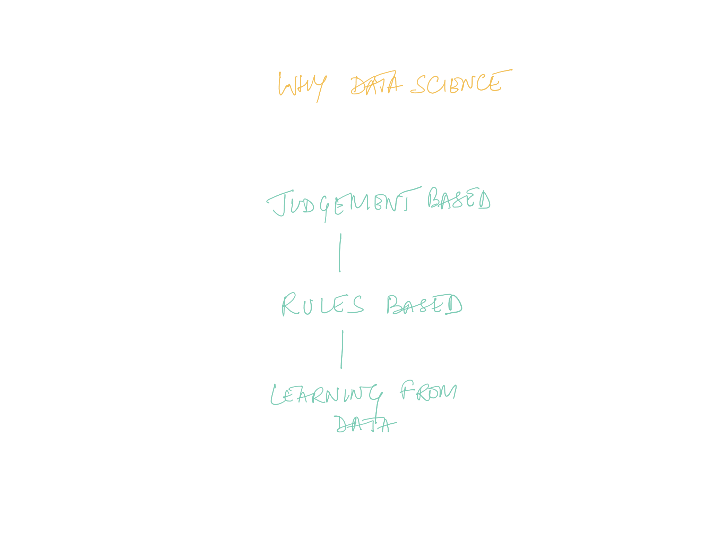

slidenumber: true
theme: work, 3

# [fit] **Bootstrap Data Science**
## [fit] *Building and Scaling Data Science Capabilities*

 
 

**Amit Kapoor**
[amitkaps.com](http://amitkaps.com)

**Bargava Subramanian**
[bargava.com](http://bargava.com)

---

# **Introductions**

- Share your **name** and **background**.
- Tell us about your **current organisation**.
- Explain how you are using **analytics** there.

---

> _**Building and scaling data science capability**_ is an imperative for enterprises and startups aiming to adopt a **data-driven lens** for their business. 

---

> Crafting a **successful data-science strategy** is _**hard**_.

---

---

---

---

---

# **Strategy & Tactics**
- What part of the business should I **target first for adoption**? 
- Should I take a **jump-start** approach or a **bootstrap** approach?

---

# **Process & Systems**

- How should I set up an **initial process** for data science?
- How to I **integrate data-driven processes** with existing business systems?

---

# **Structure & Roles**

- Should I adopt a functional or a business-focussed data science structure? 
- What specialised roles should I be hiring for?
  - Data engineering
  - Machine Learning expert
  - Visualisation expert
  - Data Analyst?

---

# **Tools & Stack**
- Should I build a **vertical or horizontal** analytical technology stack? 
- How do I **integrate analytical models** with existing applications? 

---

# **Engineering & Technical**
- What are the **pitfalls** to watch out for? 
- How to avoid **pre-mature over-engineering** of data science?
- How to manage the **ongoing technical debt** for data science?

---

# **Skills & Competencies**

- How do I **up-skill** my entire organisation to use analytics?
- How do I build **differentiated competency for data science across the organisation?

---

# [fit] **Bootstrap Data Science**
## [fit] *Building and Scaling Data Science Capabilities*

 
 

**Amit Kapoor**
[amitkaps.com](http://amitkaps.com)

**Bargava Subramanian**
[bargava.com](http://bargava.com)